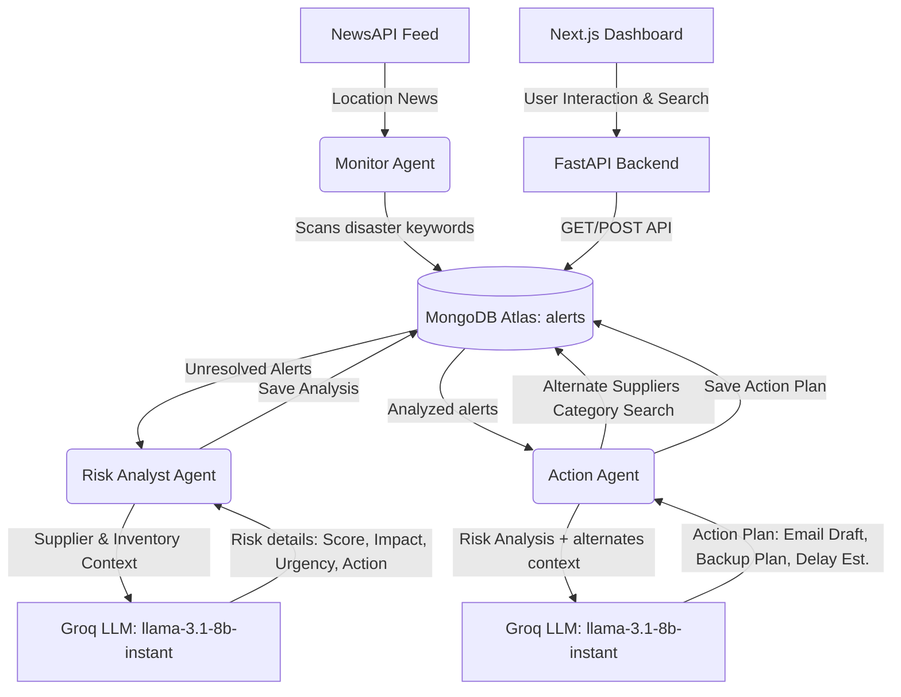

# ⚡ SupplyMind — AI Supply Chain Disruption Monitor

SupplyMind is a multi-agent AI system designed to monitor supplier networks in real-time, detect supply chain disruptions from news feeds, analyze business risks using LLMs, and autonomously generate operational action plans.

---

## 🏗️ System Architecture

SupplyMind uses an event-driven, multi-agent pipeline backed by MongoDB and LLMs:



### The 3 Agents:

1. **Monitor Agent**: Runs on a schedule/pipeline trigger. It fetches recent news articles matching each supplier's location (using NewsAPI), checks for disaster keywords (e.g., *flood, cyclone, strike, earthquake, storm, shutdown, protest, fire, drought*), and creates new alerts in MongoDB.
2. **Risk Analyst Agent**: Scans unresolved alerts. For each alert, it retrieves supplier data and current inventory days remaining. It calls Groq LLM (`llama-3.1-8b-instant`) to assess a structured `RISK_SCORE` (1-10), `IMPACT`, `URGENCY`, and an immediate `ACTION`. It saves this analysis back to the alert.
3. **Action Agent**: Takes analyzed alerts, queries MongoDB for alternate suppliers in the same category, and sends the context to Groq to generate a draft email (`EMAIL_SUBJECT` & `EMAIL_BODY`), a `BACKUP_PLAN` utilizing alternate suppliers, and an `ESTIMATED_DELAY` in days. It writes the action plan back to the alert.

---

## ⚡ Key Features

- **Real-Time Pipeline**: Runs end-to-end monitoring, analysis, and operational action drafting.
- **MongoDB Atlas Vector Search**: Performs semantic queries on suppliers based on name, category, items supplied, and location using Gemini `text-embedding-004` embeddings.
- **Graceful Fallback**: If the MongoDB Atlas Search index is not configured or fails, the API automatically falls back to regex-based text search over fields.
- **Robust Error Handling**: Agents are designed to handle missing keys, network timeouts, and DB failures gracefully without failing the pipeline.
- **Next.js 14 Dashboard**: View suppliers status, inventory days remaining (color-coded status), simulation controls, and real-time alert/action feeds in a beautiful dark theme interface.

---

## ⚙️ Environment Variables

Create a `.env` file in the `backend/` directory:

```env
MONGODB_URI=mongodb+srv://<username>:<password>@cluster0.xxxx.mongodb.net/?retryWrites=true&w=majority
GROQ_API_KEY=gsk_xxxxxxxxxxxxxxxxxxxxxxxx
NEWS_API_KEY=xxxxxxxxxxxxxxxxxxxxxxxxxxxxxxxx
GEMINI_API_KEY=AIzaSyxxxxxxxxxxxxxxxxxxxxxxxx
JWT_SECRET_KEY=yoursupersecurejwtsecretkeyhere
ADMIN_USERNAME=admin
ADMIN_PASSWORD=yoursecuraadminpasswordhere
```

---

## 📊 MongoDB Atlas Vector Search Index Configuration

To enable semantic query search, you must create Vector Search Indexes inside your MongoDB Atlas cluster:

### 1. Suppliers Collection Index
Create an index on the **`suppliers`** collection:
1. Go to your MongoDB Atlas dashboard.
2. Navigate to **Atlas Search** (or **Search** tab in your database collection view).
3. Click **Create Search Index** and choose **JSON Editor**.
4. Select the **`supplymind`** database and the **`suppliers`** collection.
5. Name the index **`vector_index`**.
6. Paste the following index definition:
```json
{
  "fields": [
    {
      "numDimensions": 768,
      "path": "embedding",
      "similarity": "cosine",
      "type": "vector"
    }
  ]
}
```
7. Click **Next** and then **Create Search Index**.

### 2. Contracts Collection Index
Create an index on the **`contracts`** collection:
1. Repeat the steps above, selecting the **`contracts`** collection instead.
2. Name the index **`vector_index_contracts`**.
3. Paste the exact same index definition (as shown above) and click **Create Search Index**.

---

## 📊 Scalability & Performance Benchmarks (Synthetic Load Testing)

SupplyMind's concurrency architecture has been tested under a synthetic load of **500+ suppliers, inventory items, and contracts** to measure scaling behavior.

> [!WARNING]
> This demonstrates the concurrency architecture's theoretical scaling behavior under simulated load; real-world NewsAPI latency and rate limits may differ.

### Concurrency & Batching
* **Monitor Agent Concurrency**: To evaluate performance, we ran a synthetic benchmark of 100 location fetches with a simulated typical NewsAPI response latency of 120ms.
  * **Sequential Fetch**: Took **12.10 seconds** to complete.
  * **Concurrent Fetch (`ThreadPoolExecutor` with 20 threads)**: Completed in **0.62 seconds**, representing a **19.47x speedup**.
* **Rate-Limit Handling**: The Monitor Agent intercepts HTTP 429 status codes from NewsAPI, performing exponential backoff (`3s`, `6s`, `9s`) to prevent service blockages.

---

## 🤖 Agentic Guardrails & Trade-offs (Observe-Decide-Act Loop)

The **Risk Analyst Agent** implements an active **Observe-Decide-Act (ODA) loop** utilizing Groq function-calling. Rather than running a static script, the agent autonomously queries supplier histories or fetches additional news before deciding whether to finalize or escalate.

### Cost vs. Autonomy Trade-off
* **Trade-off**: Dynamic ODA tool-calling gives the agent autonomy to self-correct and self-verify, but worst-case scenarios can require multiple LLM roundtrips per alert. At 500+ scale, 3 rounds per alert could lead to 1500 LLM calls under a heavy crisis event.
* **Early Exits**: The ODA loop exits immediately when sufficient confidence is reached or if the agent triggers `escalate_to_human_queue`. This prevents unnecessary billing rounds.
* **Configurable Caps**: Total tool-calling rounds can be restricted or disabled entirely using environment variables in `backend/.env`:
  * `MAX_AGENT_ROUNDS=3` (Limits loop rounds per alert)
  * `ALLOW_AGENTIC_TOOLS=true` (Toggle to `false` to disable tool-use entirely and run a single-round risk analysis)

---

## 🚀 Setup & Running Instructions

### Backend (FastAPI)

1. Navigate to the `backend` folder:
   ```bash
   cd backend
   ```
2. Create and activate a Python virtual environment:
   ```bash
   python -m venv .venv
   # Windows:
   .venv\Scripts\activate
   # macOS/Linux:
   source .venv/bin/activate
   ```
3. Install dependencies:
   ```bash
   pip install -r requirements.txt
   ```
4. Seeding initial data (RajPlastics, ChennaiPolymers, HydroLabels):
   ```bash
   python seed_data.py
   ```
5. Run the FastAPI development server:
   ```bash
   uvicorn main:app --reload --port 8000
   ```

### Frontend (Next.js 14)

1. Navigate to the `frontend` folder:
   ```bash
   cd frontend
   ```
2. Install npm dependencies:
   ```bash
   npm install
   ```
3. Start the Next.js development server:
   ```bash
   npm run dev
   ```
4. Open [http://localhost:3000](http://localhost:3000) in your browser.
